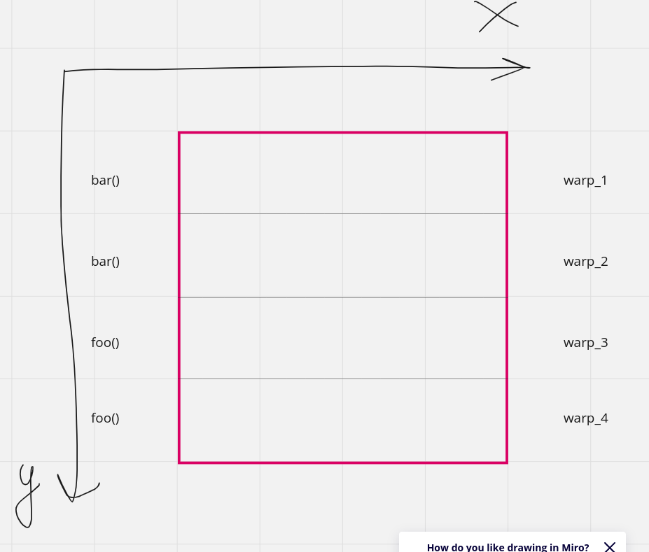

### 1
Мне кажется, что проще реализовать 
`y1[n] = x[n - 1] + x[n] + x[n + 1]`, так как во втором случае - `y2[n] = y2[n - 2] + y2[n - 1] + x[n]` есть зависимость от уже вычесленных элементов и надо думать, что с этим делать (по ощущениям это принципиально не распараллеливается).

### 2

Привожу картинку того, как я понял, как вылядит воркгруппа в варпом внутри(варпы распологаются по строчкам воркгруппы из условия). Функции будут исполнятся именно так, ведь значение по оси ox умножается на 32, значит для всей первой строчки остаток будет 0, для второй - 1, для i-ой - (i -1), значит code divergence не произойдет.

### 3
#### a
Будет coalesced так как первые 32 числа будут с одним get_local_id(1), значит значения адресов будут 0, 1 * size_of(float), 2 * size_of(float) и тд до 32, это помещается ровно в одну кэш линию. И это значит, что один варп использует по 1 линии, значит всего будет 32 обращения к кэш линииям.
### б
Не будет coalesced, так мы поочереди берем 32 * i адрес, значит на каждое новое значение нужное нам - необходимо подгрузить новую кэш линию. Значит всего обращений будет 32 * 32 = 1024
### в
Будет coalesced. Но из-за смещения каждый варп будет подгружать две кэш линии так как необходимо будет подргузить то, что не влезло в первую из-за сдвига. Итог - 64 обращения.